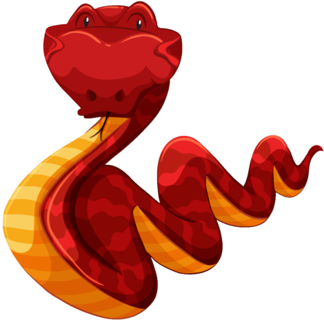
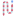

# Hosting Static Web Apps
### ```HTML``` ```CSS``` ```JavaScript```
```You can play the games by following the link below```

<hr/>

[ Eyes On Cursor](https://geetu040.github.io/eyes-on-cursor/) - Cartoons' Eyes will follow Your Cursor

[ Intelli Snake 2](https://geetu040.github.io/intelli-snake-2/) - Automated Snake that runs through the Maze to find Food

[ Snake Game](https://geetu040.github.io/snake/) - Simple Snake Game

[ Airplane Game](https://geetu040.github.io/airplane/) - Simple Airplane Game

[ Daraz Clone](https://geetu040.github.io/daraz-clone/) - Cloned a Famous E-commerce website

[ Word Align](https://geetu040.github.io/word-align/) - Beautifies Raw file of special format

[ Tic Tac Toe](https://geetu040.github.io/tic-tac-toe/) - Play Against Computer that uses a special algorithm

<hr/>
